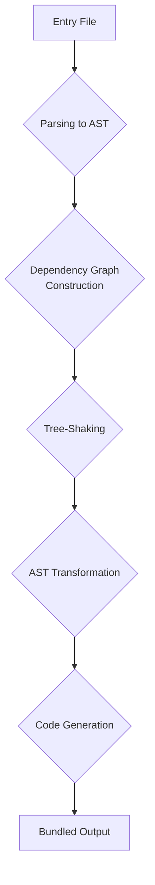

# Bundler

This is a minimalist JavaScript bundler created to explore the inner workings of modern module bundlers like Rollup and webpack. It's a tool built for learning and experimentation, and not intended for production use.

## Features

- **ES Module Support:** Works with `import` and `export` syntax.
- **Tree-Shaking:** Automatically removes unused code to keep your bundles small.
- **Scope Hoisting:** Combines modules into a single scope for faster, smaller code.
- **Dependency Resolution:** Traverses your module graph to include all necessary code.
- **Minimalist Core:** A small, focused codebase that's easier to understand.

## Usage

You can use Bundler to bundle your JavaScript projects from the command line.

```bash
npx bundler bundle --entry ./src/index.js --output ./dist/bundle.js
```

### Options

| Option        | Description                            | Default             |
| ------------- | -------------------------------------- | ------------------- |
| `--entry`     | The entry point of your application.   | (required)          |
| `--output`    | The path to write the bundled file to. | (required)          |
| `--treeshake` | Enable or disable tree-shaking.        | `true`              |
| `--minify`    | Minify the output bundle.              | `false`             |
| `--config`    | Path to a configuration file.          | `bundler.config.js` |

### Configuration File

You can also configure Bundler using a `bundler.config.js` file:

```javascript
// bundler.config.js
export default {
  entry: './src/index.js',
  output: './dist/bundle.js',
  minify: true,
};
```

## How It Works



## Development

To get started with development:

1.  Clone the repository:
    ```bash
    git clone https://github.com/OmkarJ13/bundler.git
    ```
2.  Install dependencies:
    ```bash
    npm install
    ```
3.  Run the tests:
    ```bash
    npm test
    ```

---

Built with curiosity by [OmkarJ13](https://github.com/OmkarJ13).
